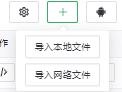

#链接：https://i.gkd.li/



    右上角的添加按钮用来导入分享进来的快照文件
    android按钮用来连接手机，生成的快照可以直接在列表中看到

###审查页面属性
*快照地址：https://i.gkd.li/snapshot/1713518797430*
```
    id	    ""                       元素（唯一标识符）               可以用正则
    vid	    null                     元素ID                          可以用正则
    name	"android.view.View"  元素名称（最后一个View是实例）      
    text	null                 内容                            可以用正则
    text.length	null                 内容的长度
    desc	"3跳过"              描述                         
    desc.length	3                    描述内容的长度 
    clickable	true                 点击事件可触发（clickCenter/clickNode）
    focusable	true                 获取焦点事件可触发（暂无）
    checkable	false                不可以被勾选（暂无）
    checked     false                默认选中（暂无）
    editable	false                不可以编辑（暂无）
    longClickable	false        点击后长按（longClick/longClickCenter/longClickNode）
    visibleToUser	true         展示给用户
    left	831                  元素的左边距离屏幕最左边
    top         96                   元素的顶部距离屏幕最顶部
    right	975                  元素的右边距离屏幕最左边
    bottom	165                  元素的底部距离屏幕最顶部
    width	144                  元素的宽
    height	69                   元素的高
    childCount	0                    子元素的数量
    index	0                    当前元素在父级元素中排序 从 0 开始
    depth   12                       当前元素在快照中的层级 最外层为 0 
    _id     12                       模拟属性（不可用）
    _pid    11                       模拟属性（不可用）
```


