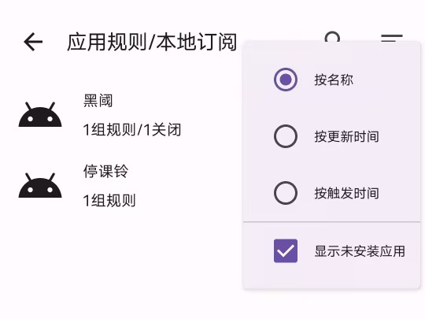
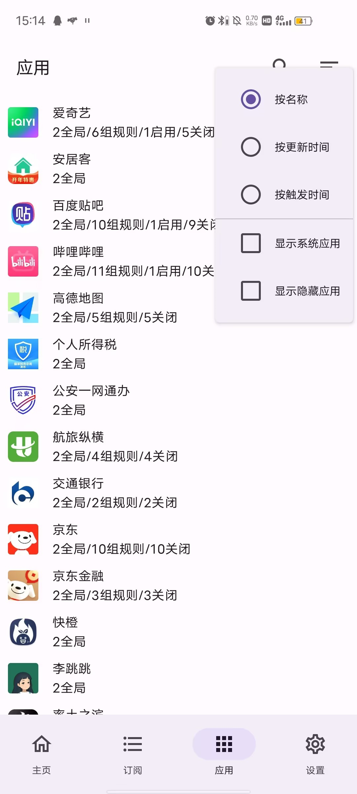
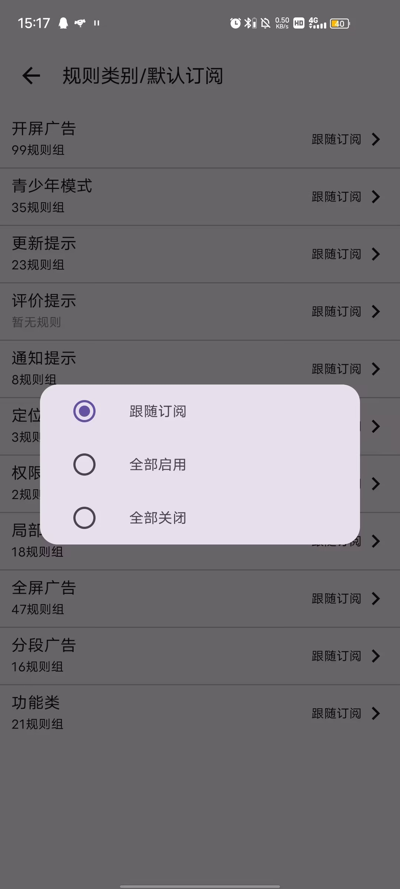

# 全局规则
```text
[
  {
    key: 0,
    name: '开屏广告',      // 当前规则组在列表中的唯一标识, 也是客户端禁用/启用此规则组的依据 设置后不可更改, 否则造成App启用/禁用错乱, key 没有顺序大小之分, 可以是任意数字
    order: -1,            // 规则参与匹配的顺序, 数字越小越先匹配, 如果两个规则 order 相同, 按照 groups 中的数组顺序匹配, app 类型规则顺序优先于 global 类型规则,属于不同订阅的规则按照订阅列表中顺序匹配, 长按订阅卡片可以拖动排序 默认为0
    actionMaximum: 2,     // 规则的 action 被执行的最大次数, 达到最大次数时, 休眠此规则最大执行次数 规则的动作（点击、长按等） 当规则准备匹配/或被唤醒时, 将重新计算次数
    matchTime: 10000,     // 规则匹配时间, 此规则参与查询屏幕节点时, 等待一段时间, 休眠此规则
    resetMatch: 'app',    // 当规则因为 matchTime/actionMaximum 而休眠时, 如何唤醒此规则  activity:当 activity 刷新时, 唤醒规则、 app: 重新进入 app 时, 唤醒规则
    actionCdKey: 0,       // 与这个 key 的 rule 共享次数, 比如开屏广告可能需要多个 rule 去匹配, 当一个 rule 触发时, 其它 rule 的触发是无意义的, 如果你对这个 key 的 rule 设置 actionMaximum=1, 那么当这个 rule 和 本 rule 触发任意一个时, 两个 rule 都将进入休眠
    actionMaximumKey: 0,  // 规则参与匹配的顺序, 数字越小越先匹配, 如果两个规则 order 相同, 按照 groups 中的数组顺序匹配, app 类型规则顺序优先于 global 类型规则, 属于不同订阅的规则按照订阅列表中顺序匹配, 长按订阅卡片可以拖动排序
    rules: [              // 规则集合
      {
        key: 0,           // 当前分类在列表中的唯一标识
        quickFind: true,  // 同时也是分类的依据, 捕获以 name 开头的所有 APP 规则组, 不捕获全局规则组，示例: `开屏广告` 将捕获 `开屏广告-1` `开屏广告-2` `开屏广告-233` 这类 APP 规则组
        matches: '[text*="跳过"][text.length<10][visibleToUser=true]',
        enable: false     // 默认值 全部（启用、禁用）捕获的规则组
      },
      {
        key: -1,
        matches:
          '[childCount=0][visibleToUser=true][(text.length<10&&(text*="跳过"||text*="跳過"||text*="skip"||text*="Skip")) || id$="tt_splash_skip_btn" || vid*="skip" || vid*="Skip" || (vid*="count" && vid*="down" && vid!*="download") || desc*="跳过" || desc*="skip"]',
      },
    ],
    apps: diabledAppIds.map((id) => ({ id, enable: false })),  // 忽略： 这段文本在代码中添加功能是  应用规则已有此类规则, 则在全局规则禁用此应用
  },
]
```
# 全局规则最简实例
```text
  {
    key: 2,
    name: '青少年模式',
    order: 1,
    actionMaximum: 2,
    matchTime: 10000,
    resetMatch: 'app',
    actionCdKey: 0,
    actionMaximumKey: 0,
    rules: [
      {
        key: 0,
        quickFind: true,
        matches: '[text*="跳过"][text.length<10][visibleToUser=true]',
      },
    ]
  }
```

# 应用规则
```text
{
  id: 'cn.com.ruijie.magicbox',  // 包名
  name: '无线魔盒',               // 如果设备没有安装这个 APP, 则使用这个 name 显示
  groups: [
    {
      key: 1,                   // 当前规则组在列表中的唯一标识
      name: '更新弹窗',           // 当前规则组的名字
      desc： '简介',
      actionMaximum?: 0,        // 同全局规则
      resetMatch: 'app',        // 同全局规则
      enable: false,            // 同全局规则
      quickFind: true,          // 快速查找功能
      activityIds: 'cn.com.ruijie.wifibox.activity.MainActivity', // 匹配设备界面Id， 如果要匹配所有界面: `undefined` (不填写) 或者 `[]`
      rules: [                  // 规则集合 第一种写法
        '@ImageView[id="cn.com.ruijie.magicbox:id/imageView_close"] +(2) RelativeLayout > LinearLayout > [text*="新版本"]',
      ],
      rules: [                  // 规则集合 第二种写法
        {
          name: '字节SDK',
          matches:
            '@[id="com.byted.pangle:id/tt_splash_skip_btn"] <<n [id="cn.lezhi.speedtest:id/fl_splash_container"]',
          snapshotUrls: 'https://i.gkd.li/import/13544242',
        },
        {
          preKeys: 0,           // 用作连续动作 要求当前列表里某个 key 刚刚执行， 比如点击关闭按钮-选择关闭原因-确认关闭, key 分别是 1,2,3, preKeys 分别是 [],[1],[2]
          quickFind: true,
          activityIds: 'cn.wsds.gamemaster.ui.gamedetails.ActivityGameDetails',
          matches: '[text="不感兴趣"]',
          snapshotUrls: 'https://i.gkd.li/import/13930399',
        },
      ],
      snapshotUrls: 'https://i.gkd.li/import/12642359', // 快照地址
    },
  ],
}
```
# App规则最简实例
```text
{
  id: 'me.piebridge.brevent',
  name: '黑阈',
  groups: [
    {
      enable: false,
      key: 1,
      name: '权限不足弹窗',
      desc: '点击取消',
      activityIds: ['me.piebridge.brevent.ui.BreventActivity'],
      actionMaximum: 1,
      quickFind: true,
      rules: [
        {
          matches: [
            '[id="android:id/message"][text^=`黑阈服务权限不足`]',
            '[text=`取消`][id^=`android:id/button`]',
          ],
          snapshotUrls: 'https://i.gkd.li/import/13218439',
        },
      ],
    },
  ],
}
```


# 分类
```text
[
  {
    key: 0,
    name: '开屏广告',
  },
  {
    key: 1,
    name: '青少年模式',
  },
  {
    key: 2,
    name: '更新提示',
  },
  {
    key: 3,
    name: '评价提示',
  },
  {
    key: 4,
    name: '通知提示',
  },
  {
    key: 5,
    name: '定位提示',
  },
  {
    key: -1,
    name: '权限提示',
  },
  {
    key: 6,
    name: '局部广告',
    // 不影响使用的广告, 所有的广告卡片及悬浮广告按钮
  },
  {
    key: 7,
    name: '全屏广告',
    // 不关闭广告就无法进行其它操作的广告弹窗, 它阻碍用户操作
    // 一般是刚进入APP时显示的全屏弹窗
  },
  {
    key: 8,
    name: '分段广告',
    // 如微信朋友圈广告/酷安帖子广告/贴吧帖子广告
    // 需要分阶段多步操作才能关闭, 会造成屏幕略微闪烁, 稍微影响用户体验
  },
  {
    key: 9,
    name: '功能类',
    // 非广告, 点击某些功能按钮
  },
];
```

# 注释

`-应用中-显示的是手机上安装的所有应用`



`-应用规则-中可以查看所有添加了规则的应用`



### 批量订阅
    跟随订阅 --- 根据应用规则中设置的enable选择启用捕获 （在最新版本中已经失效）

    全部启用 --- 全部启用捕获的规则组

###参考地址：https://github.com/gkd-kit/gkd/issues/438



##权限设置（定位，通知，电话等系统类权限的规则添加）

    需要注意因为权限弹窗不是属于当前打开应用的页面，并且他的权限开关是默认关闭的

    所以需要在规则中配置默认打开权限应用的开关（"enable":true）在static.json文件中的apps栏目下有配置实例

