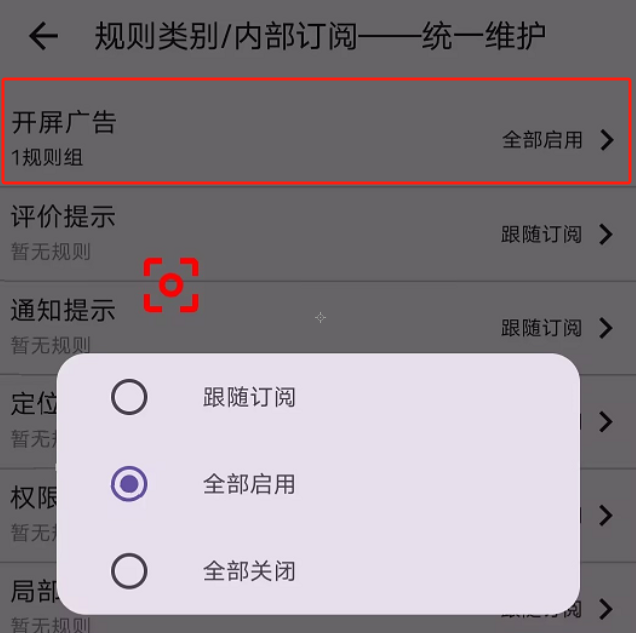

## 优先级: 规则手动配置 > 分类手动配置 > 分类默认 > 规则默认值


### 一、 规则默认值  ——— 开关一
    规则开关的默认值由 enable 控制，若设置为 ‘false’ 则关闭

```text
    {
        "key": 0,
        "name":"开屏广告",
        "enable":false,
        "desc":"触发点击操作",
        "rules": ...
    }
```

### 二、 分类默认  ——— 开关二
    这个开关打开时才会对内部订阅进行判定

### 三、 分类默认  ——— 开关三（已弃用）
    根据订阅分类批量控制开关



### 四、 全局订阅  ——— 开关四 (App规则作用顺序要优先于全局规则)
    基于订阅规则进行分类，全局订阅不受开关一二三影响，作用于所有的app

