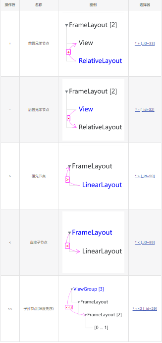

#GKD 属性选择器

```text
@TextView[a=1][b^='2'][c*='a'||d.length>7&&e=false]
```
@ 表示选择此节点, 一条规则最后属性选择器 @ 生效, 如果没有 @, 取最后一个属性选择器

TextView 代表节点的 name 属性, 而且与 CSS 相似, * 表示匹配任意属性

由于该选择器主要用于 Android 平台, 节点的 name 都是 java 类如 android.text.TextView 这种形式

为了方便书写规则, 上述 TextView 等价于 
```text
[name='TextView'||name$='.TextView']
```
内部是一个 逻辑表达式/布尔表达式

----- 逻辑表达式 -> name='TextView'||name$='.TextView'

----- 布尔表达式 -> name='TextView'

逻辑表达式 有两个操作符 || 和 &&

&& 优先级更高, 即
```text
[a>1||b>1&&c>1||d>1] 
```
等价于
```text
[a>1||(b>1&&c>1)||d>1]
```

并列的 [] 视为使用 && 的逻辑表达式, 即 [a=1][b=1] 等价于 [a=1&&b=1]

布尔表达式 由 属性名 操作符 值 顺序构成

###属性名
正则匹配
```text
^[_a-zA-Z][a-zA-Z0-9_]*(\.[_a-zA-Z][a-zA-Z0-9_]*)*$ 
```
类似合法变量名 a/a.length

###操作符
|操作符|名称|说明|
| --- | --- | --- |
| = |equal||
| --- | --- | --- |
| != |notEqual||
| --- | --- | --- |
| > |more||
| --- | --- | --- |
| >= |moreEqual||
| --- | --- | --- |
| < |less||
| --- | --- | --- |
| <= |lessEqual||
| --- | --- | --- |
| ^= ||以...开头|
| --- | --- | --- |
| !^= ||不以...开头|
| --- | --- | --- |
| *=||包含...|
| --- | --- | --- |
| !^= ||不包含...|
| --- | --- | --- |
| $=||以...结尾|
| --- | --- | --- |
| !$= ||不以...结尾|
| --- | --- | --- |
| ~= ||正则匹配...|
| --- | --- | --- |
| !~= ||正则不匹配...|
| --- | --- | --- |


#GKD  关系选择器
_关系选择器 由 关系操作符 和 关系表达式 构成, 用于连接两个属性选择器_

    简单示例: div > a, 它 表示/约束 两个节点之间的关系, 下面介绍 关系操作符 和 关系表达式

##关系表达式
_关系表达式 表示查找节点的范围, 有两种_

###元组表达式 
_(a1,a2,a3,a_n), 其中 a1, a2, a3, a_n 是常量有序递增正整数_ 

    示例: (1), (2,3,5)

###多项式表达式 
_(an+b), 其中 a 和 b 是常量整数, 它是元组表达式的另一种表示_

    这个元组的数字满足集合 {an+b|an+b>=1,n>=1} 如果集合为空集则表达式非法

    当 a<=0 时, 它具有等价的元组表达式
    示例 (-n+4) 等价于 (1,2,3)
    示例 (-3n+10) 等价于 (1,4,7)

    当 a>0 时, 它表示无限的元组表达式
    示例 (n), 它表示 (1,2,3,...) 一个无限的元组
    示例 (2n-1), 它表示 (1,3,5,...) 一个无限的元组
### 关系操作符
_关系操作符 表示查找节点的方向, 有 5 种关系操作符, +, -, >, <, <<_


_将 关系操作符 和 关系表达式 连接起来就得到了 关系选择器_

    A +(a1,a2,a3,a_n) B 
    A 是 B 的前置兄弟节点, 并且 A.index 满足 B.index-(a_m), 其中 a_m 是元组的任意一个数字

    A -(a1,a2,a3,a_n) B
    A 是 B 的后置兄弟节点, 并且 A.index 满足 B.index+(a_m)

    A >(a1,a2,a3,a_n) B
    A 是 B 的祖先节点, 并且 A.depth 满足 B.depth-(a_m), 根节点的 depth=0

    A <(a1,a2,a3,a_n) B
    A 是 B 的直接子节点, 并且 A.index 满足 a_m-1

    A <<(a1,a2,a3,a_n) B
    A 是 B 的子孙节点, 并且 A.order 满足 a_m-1, A.order 是深度优先先序遍历的索引
###表达式简写
_一般情况下, 并不需要写严格完整的表达式, 使用简化写法更方便快捷_

_`下面是一些特殊情况下的简写表示`_

_当 a=0 或 b=0 时, 括号可以省略, 以 + 为例_

    A +(3n+0) B -> A +(3n) B -> A +3n B
    A +(0n+3) B -> A +(+3) B -> A +3 B
    当 a=0 且 b=1 时, an+b 可以省略, 以 + 为例

    A +(0n+1) B -> A + B
    此外 A + B,A > B 都与等价的 CSS 语法语义相同

    当 a=1 且 b=0 且操作符是 >, 可以进一步简写, 比如

    A >(1n+0) B -> A >n B -> A B
    这与等价的 CSS 语法语义相同


